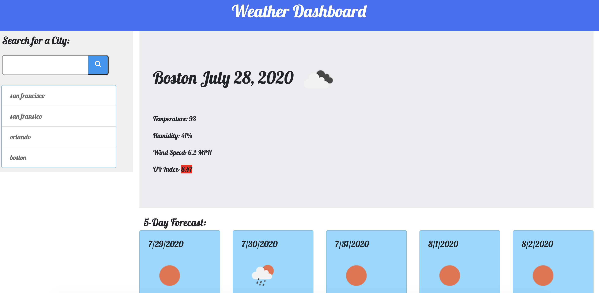

# Weather_Dashboard

A weather dashboard that will run in the browser and feature dynamically updated HTML and CSS

## How it works

In the web application you will only need to put in a city of your choice. If it does not exist or is spelled wrong then nothing will happen.

- You can type the **city name** in the search bar and it will give you the **current time/weather** and a **5-day forecast for it**

- The city you searched will then be put underneath as a **previous search section** (_goes up to 10_).

  - On here you can _click_ any of the previous cities to get the weather for it

- When you refresh or click back on this page it will automatically give you the weather for the previous city you looked up.

## Resources used and link to the Web App

- jQuery
- Open Weather Map API
- moment.js
- [Weather Dashboard](https://kooki-ebyte.github.io/Weather_Dashboard/)

### Project made by : Cristian Hornedo

### Open to contributions

- Please leave detailed pull requests for your contribution
